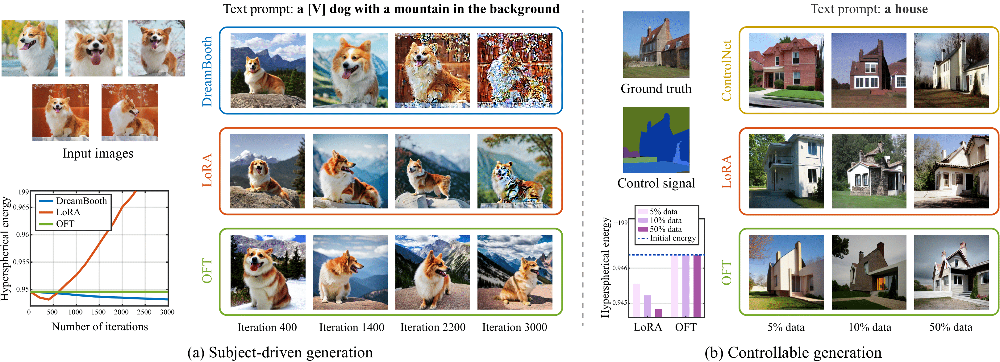

# Controlling Text-to-Image Diffusion by Orthogonal Finetuning

<div align="center">
  
</div>

## Introduction

Large text-to-image diffusion models have impressive capabilities in generating photorealistic images from text prompts. How to effectively guide or control these powerful models to perform different downstream tasks becomes an important open problem. To tackle this challenge, we introduce a principled finetuning method -- Orthogonal Finetuning (OFT), for adapting text-to-image diffusion models to downstream tasks. Unlike existing methods, OFT can provably preserve hyperspherical energy which characterizes the pairwise neuron relationship on the unit hypersphere. We find that this property is crucial for preserving the semantic generation ability of text-to-image diffusion models. To improve finetuning stability, we further propose Constrained Orthogonal Finetuning (COFT) which imposes an additional radius constraint to the hypersphere. Specifically, we consider two important finetuning text-to-image tasks: subject-driven generation where the goal is to generate subject-specific images given a few images of a subject and a text prompt, and controllable generation where the goal is to enable the model to take in additional control signals. We empirically show that our OFT framework outperforms existing methods in generation quality and convergence speed.

Stay tuned, more information and code coming soon.


## Update
- **2023.6.23**: initial commit. Code for running controllable generation (ControlNet-like tasks) and subject-driven generation (Dreambooth-like tasks).


## TODO
We expect the first version of our code will be released on 23rd June. Thanks!
- [x] Code for running controllable generation (ControlNet-like tasks)
- [x] Code for running subject-driven generation (Dreambooth-like tasks)
- [ ] Refine readme
- [ ] Fast version of OFT
- [ ] More examplar applications

<!--
## Getting Started

### Downloading Data

1. Run the scripts in the 'scripts' folder to automatically download the preprocessed data required for `oft-control`, e.g., for running the densepose-to-image experiment, run the script:
```console
bash scripts/dataset_setup_control_deepfashion.sh
```

2. Download and store the [dreambooth](https://github.com/google/dreambooth) dataset within `data/dreambooth` to run `oft-db`.

After downloading and placing the data, your directory structure should look like this:
```
data
├── ADE20K
│ ├── train
│ │ ├── color
│ │ ├── segm
│ │ └── prompt_train_blip.json
│ └── val
│ │ ├── color
│ │ ├── segm
│ │ └── prompt_val_blip.json
└── COCO
│ ├── train
│ │ ├── color
│ │ ├── depth
│ ...
...
├── dreambooth
│ ├── backpack
│ ├── backpack_dog
│ ...
```

### Downloading pre-trained model weights

1. To download the required model for this project, visit the following link: [v1-5-pruned.ckpt](https://huggingface.co/runwayml/stable-diffusion-v1-5/tree/main)

2. Store the downloaded model weights in the `models` directory.


## Installation

Follow these steps to set up the project environment:

1. Clone the oft repository. We'll call the directory that you cloned oft as $OFT_ROOT.
```console
git clone https://github.com/Zeju1997/oft.git
```

2. Construct the virtual environment:
```console
conda env create -f environment.yml
```

3. Install [diffusers](https://github.com/huggingface/diffusers)
```bash
pip install –upgrade diffusers[torch]
```

4. Optional, install [xformers](https://github.com/facebookresearch/xformers) 
```bash
pip install -U xformers
```

## Usage

There are only two hyperparameters that one need to adjusted, we noticed that generally with more number of blocks the fine-tuning results become worse. Block sharing is default false, but might work if the control is very simple.
- Number of blocks: r
- eps-deviation (only with the constrained variant COFT): eps
- Block-sharing: block_share

|                   | r = 2   | r = 4   | r = 8   | r = 16  |
|-------------------|---------|---------|---------|---------|
| Trainable Params  | 29.5 M  | 16.3 M  | 9.7 M   | 6.4 M   |
| mIoU ↑            | 27.18   | 27.06   | 24.09   | 21.0    |
| mAcc ↑            | 39.39   | 40.09   | 36.95   | 32.55   |
| aAcc ↑            | 65.24   | 62.96   | 60.25   | 55.5    |


### Controllable Generation

1. Create the model with additional **OFT** parameters:
```console
python oft-control/tool_add_control_oft.py \
  --input_path=./models/v1-5-pruned.ckpt \
  --output_path=./models/control_sd15_ini_oft.ckpt \
  --eps=1e-3 \
  --r=4 \
  --coft
```
2. Specify the control signal and dataset. Train the model specify the same hyperparameters as above:
```console
python oft-control/train.py \
  --eps=1e-3 \
  --r=4 \
  --coft
```
3. Because **OFT** does not affect the neuron norm, the neuron magnitude might be sub-optimal. Run the following script for performing magnitude post-stage fitting after training an oft to improve on the magnitude.
```console
python oft-control/train_with_norm.py 
```
4. After finetuning with **OFT**, run inference to generate images based on control signal. Because the inference takes some time, to perform large scale evaluation, we split the dataset into different sub-datasets and run inference on multiple gpus:
```console
python oft-control/test_oft_parallel.py /
  --idx==1 \
  --eps=1e-3 \
  --r=4 \
  --coft
```

#### 

### Subject-driven Generation
1. Similar to the example for dreamfusion, you can run the finetuning using oft with the following command. The three paramters that need to be adjusted are

```bash
accelerate launch train_dreambooth_oft.py \
  --pretrained_model_name_or_path=$MODEL_NAME  \
  --instance_data_dir=$INSTANCE_DIR \
  --class_data_dir="$CLASS_DIR" \
  --output_dir="$OUTPUT_DIR" \
  --instance_prompt="$instance_prompt" \
  --with_prior_preservation --prior_loss_weight=1.0 \
  --class_prompt="$class_prompt" \
  --resolution=512 \
  --train_batch_size=1 \
  --gradient_accumulation_steps=1 \
  --checkpointing_steps=5000 \
  --learning_rate=5e-5 \
  --report_to="wandb" \
  --lr_scheduler="constant" \
  --lr_warmup_steps=0 \
  --max_train_steps=3005 \
  --validation_prompt="$validation_prompt" \
  --validation_epochs=1 \
  --seed="0" \
  --name="$name" \
  --num_class_images=200 \
  --eps=$eps \
  --rank=$rank \
  --coft
```
Within the 'oft-db' folder, run the training script:
```bash
./train_dreambooth_oft.sh
```
-->

## Citing our work
  ```bibtex
    @InProceedings{Qiu2023OFT,
      title={Controlling Text-to-Image Diffusion by Orthogonal Finetuning},
      author={Qiu, Zeju and Liu, Weiyang and Feng, Haiwen and Xue, Yuxuan and Feng, Yao and Liu, Zhen and Zhang, Dan and Weller, Adrian and Schölkopf, Bernhard},
      journal={arXiv preprint arXiv:2306.07280},
      year={2023}
    }
  ```


## Acknowledgements

This project builds upon the work of several other repositories. We would like to express our gratitude to the following projects for their contributions:

- [lora](https://github.com/cloneofsimo/lora): Low-rank Adaptation for Fast Text-to-Image Diffusion Fine-tuning.
- [ControlNet](https://github.com/lllyasviel/ControlNet): Official implementation of Adding Conditional Control to Text-to-Image Diffusion Models.
- [Diffusers](https://github.com/huggingface/diffusers): A library for state-of-the-art pretrained diffusion models.


---

### Stay tuned for more updates!
